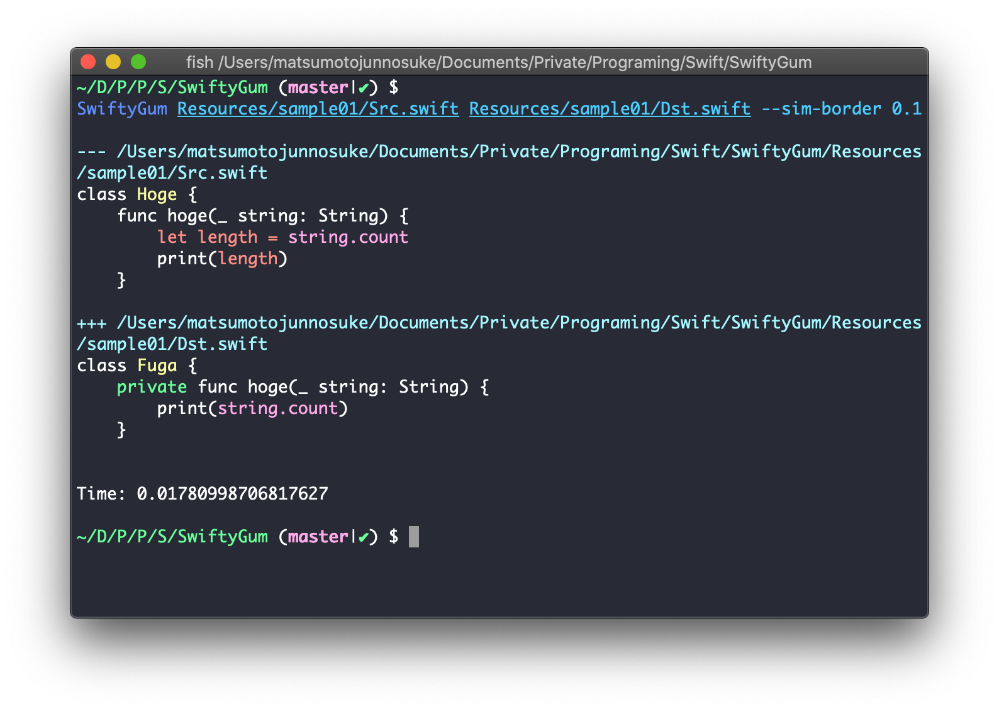

# SwiftyGum 
<a href="https://github.com/mtj0928/SwiftyGum/actions?query=workflow%3ATest"></a> 

SwiftyGum is a tool which calculates AST-based source code differences.  
This tool is a reimplementation of [GumTree](https://github.com/GumTreeDiff/gumtree) for Swift.  
If you would like to konw the detail algorithem, read the [paper](https://hal.archives-ouvertes.fr/hal-01054552/document) which proposes GumTree.  

## Screenshot
You can easily check AST-based differences.  
The green means *Insert*, the red means *Delete*, the yellow means *Update*, and the purple means *Move*.  



## Build
```
$ swift build -c release
```

The executable files are generated in `.build/release` 

## How To Use
```
Usage:

    $ ./.build/release/SwiftyGumCLI <src> <dst>

Arguments:
    src - Source file (orifinal file)
    dst - Destination file (editted file)

Options:
    --report [default: cli] - Report format of EditScript
    --min-height [default: 1] - Minimum height that AST nodes are matched in TopDown Matching
    --sim-border [default: 0.2] - The boundary value that determins two different node should be matched.

```

## Git Integration
Add the following to  your `.gitconfig`.
```
[diff]
	tool = SwiftyGum

[difftool "SwiftyGum"]
	cmd = <The path of the executable on your system)> $LOCAL $REMOTE

[difftool]
	prompt = false
```

You can execute SwiftyGum for edited swift files in your repository.  
```
$ git difftool
```
